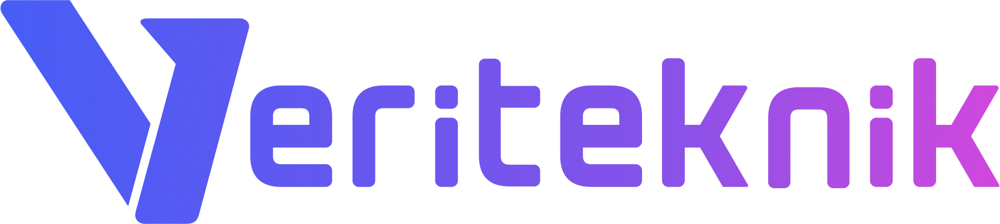

  
  **Building Model-Agnostic AI Infrastructure**
  
  
  
  
  
  

## 🎯 What We Do

VeriTeknik develops **plugged.in** - a model-agnostic platform that gives any AI system unified access to:

- **📚 Knowledge** - RAG-powered document libraries with contextual AI
- **🧠 Memory** - Persistent context and conversation history across sessions  
- **🔧 Tools** - Universal MCP (Model Context Protocol) server management

Whether you use Claude, ChatGPT, Gemini, or any other AI model, plugged.in works seamlessly with all of them.

## 🎥 Watch Plugged In Demo

*Click the thumbnail above to see plugged.in in action!*

## 🌟 The Plugged.in Ecosystem

*Note: Dashed lines in the ecosystem graph below represent features currently under development.*

### [pluggedin-app](https://github.com/veriteknik/pluggedin-app)

*One Platform. All AI Models. Unlimited Possibilities.*

The central hub for managing Knowledge, Memory, and Tools across any AI model. Connect your favorite AI to your data, context, and capabilities without vendor lock-in.

- **Technology**: TypeScript, Next.js, PostgreSQL
- **Core Features**: 
  - Universal RAG for any AI model
  - Cross-model memory and context
  - MCP server orchestration
  - Social sharing and collaboration
- **License**: AGPL-3.0
-  

### [pluggedin-mcp-proxy](https://github.com/veriteknik/pluggedin-mcp-proxy)

*One MCP Connection. Infinite Tool Access.*

The intelligent proxy that manages all your MCP servers through a single connection, compatible with any MCP-enabled AI client.

- **Technology**: TypeScript
- **Key Benefits**: Unified tool management, seamless integration, model-agnostic architecture
- **License**: Apache-2.0
- 

### [MCP Registry](https://github.com/VeriTeknik/registry)

*A community driven registry service for MCP servers.*

Discover and share MCP servers with the community. Our registry provides a centralized hub for finding and publishing MCP server implementations.

- **Technology**: TypeScript
- **License**: Apache-2.0
- 

## 🛠️ SDKs & Developer Tools

Integrate plugged.in capabilities into your applications with our official SDKs supporting Javascript, Go, and Python:

### [Plugged.inKit JS](https://github.com/VeriTeknik/pluggedinkit-js)
- JavaScript/TypeScript SDK for Node.js and browser environments
- 

### [Plugged.inKit Go](https://github.com/VeriTeknik/pluggedinkit-go)
- Go SDK for high-performance server applications
- 

### [Plugged.inKit Python](https://github.com/VeriTeknik/pluggedinkit-python)
- Python SDK for AI/ML workflows and data science
- 

## 📚 Documentation

For comprehensive guides, API references, and tutorials, visit our official documentation at [docs.plugged.in](https://docs.plugged.in/).

## 🤝 Contributing

We welcome contributions to all our projects! Whether you're interested in:

- Adding new features
- Fixing bugs
- Improving documentation
- Translating content
- Testing and reporting issues

Please check out our individual project repositories for specific contribution guidelines.

---

  
  *Building the future of AI data exchanges, one protocol at a time.*
  

